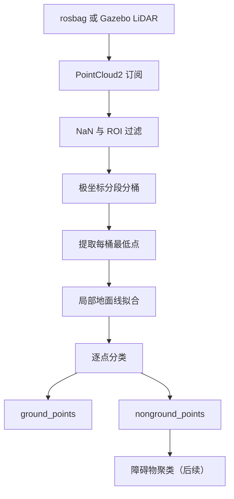

# FSAC LiDAR 地面分割项目

本项目面向大学生无人驾驶方程式赛车（FSAC），目标是从 LiDAR 点云中分离地面点和非地面点，并在此基础上继续实现障碍物聚类、锥桶候选检测以及 Gazebo 仿真验证。

当前阶段只实现以下主链路：

```text
ROS 2 bag 点云
    → 点云预处理
    → 极坐标分段与分桶
    → 局部地面线拟合
    → 地面点 / 非地面点
```

算法节点只依赖 ROS 2 话题接口。后续接入 Gazebo 时只更换输入话题，不重写地面分割算法。

## 1. 项目目录

```text
racecar_sim/
├── README.md
├── compose.yaml                       # 当前算法容器配置，后续增加 simulation 服务
├── data/                              # rosbag 和原始数据，只读挂载到容器 /data
│   ├── rosbag2_2022_04_14-ped_vehicle/
│   ├── rosbag2_2022_04_14-trucks/
│   └── T-SOLO-PYLON/
├── docker/
│   ├── Dockerfile.algorithm           # ROS 2 Jazzy 算法镜像
│   └── Dockerfile.simulation          # 后续 Gazebo Harmonic 仿真镜像
├── ros2_ws/                           # 地面分割算法工作区，挂载到容器 /ws
│   └── src/
│       └── fast_ground_segmenter/
│           ├── CMakeLists.txt
│           ├── package.xml
│           ├── config/
│           │   └── ground_segmenter.yaml
│           ├── launch/
│           │   ├── bag_ground_segmentation.launch.py
│           │   └── gazebo_ground_segmentation.launch.py
│           ├── include/fast_ground_segmenter/
│           │   ├── ground_segmenter_node.hpp
│           │   ├── point_cloud_filter.hpp
│           │   ├── polar_grid.hpp
│           │   ├── ground_line_fitter.hpp
│           │   └── types.hpp
│           ├── src/
│           │   ├── ground_segmenter_node.cpp
│           │   ├── point_cloud_filter.cpp
│           │   ├── polar_grid.cpp
│           │   ├── ground_line_fitter.cpp
│           │   └── main.cpp
│           └── test/
│               ├── test_point_cloud_filter.cpp
│               ├── test_polar_grid.cpp
│               └── test_ground_line_fitter.cpp
└── simulation_ws/                     # 后续 Gazebo Harmonic 仿真工作区
    └── src/
        ├── racecar_description/
        └── racecar_gazebo/
```

仿真工作区的 ROS 2 包骨架已经创建；具体模型、世界、桥接配置和启动文件将在对应 Gazebo 阶段逐步添加。

## 2. 模块职责

| 模块 | 职责 |
|---|---|
| `ground_segmenter_node` | 订阅和发布 ROS 2 消息、读取参数、组织算法流程 |
| `point_cloud_filter` | 删除 NaN/Inf，进行距离和高度 ROI 过滤 |
| `polar_grid` | 计算极坐标，将点按角度段和距离桶组织起来 |
| `ground_line_fitter` | 提取桶最低点、拟合局部地面线并分类点云 |
| `types.hpp` | 定义桶、地面线、点索引等公共数据结构 |
| `ground_segmenter.yaml` | 保存输入话题、ROI 和算法阈值 |
| `launch/` | 分别提供 rosbag 和 Gazebo 启动入口 |
| `test/` | 对过滤、索引和拟合逻辑进行单元测试 |

ROS 2 节点层只负责消息接口，核心算法类尽量不依赖 ROS 2，便于测试和复用。

## 3. 系统数据流



## 4. 开发阶段与验收标准

### 阶段 1：打通 PointCloud2 输入输出

任务：

- 使用 `rclcpp::SensorDataQoS()` 订阅原始点云；
- 输出点数、时间戳和 `frame_id`；
- 将输入点云原样发布到 `/debug/pass_through_points`；
- 在 RViz2 中对比输入与输出点云。

验收标准：

- 节点能够持续接收约 10 Hz 点云；
- 没有 QoS 不兼容提示；
- 输入与输出点数一致；
- RViz2 可以显示转发后的点云。

### 阶段 2：PCL 转换与 ROI 过滤

处理流程：

```text
sensor_msgs::msg::PointCloud2
    → pcl::PointCloud<pcl::PointXYZI>
    → 删除 NaN/Inf
    → 距离过滤
    → 高度过滤
```

径向距离：

$$
r = \sqrt{x^2+y^2}
$$

建议初始范围：

```yaml
min_range: 1.0
max_range: 80.0
min_z: -3.0
max_z: 2.0
```

输出调试话题：

```text
/debug/filtered_points
```

验收标准：

- 删除无效点、车身附近反射和过远点；
- 道路与主要障碍物仍然保留；
- 输出点数小于输入点数；
- 输出消息保留输入消息的 `header`。

### 阶段 3：极坐标分段与分桶

对每个点计算：

$$
r = \sqrt{x^2+y^2}, \qquad \theta = \operatorname{atan2}(y,x)
$$

推荐初始设置：

```yaml
num_segments: 360
num_bins: 120
```

角度段和距离桶索引：

$$
i_s = \left\lfloor\frac{\theta+\pi}{2\pi}N_s\right\rfloor
$$

$$
i_b = \left\lfloor\frac{r-r_{\min}}{r_{\max}-r_{\min}}N_b\right\rfloor
$$

每个桶至少保存：

```cpp
struct Bin
{
    bool occupied{false};
    float min_z{0.0F};
    float min_range{0.0F};
    std::size_t min_point_index{0};
    std::vector<std::size_t> point_indices;
};
```

验收标准：

- 每个有效点都映射到合法索引；
- 边界角度和最大距离处不发生数组越界；
- 能够发布每个非空桶的最低点。

### 阶段 4：提取地面候选点

在每个非空桶中选择 `z` 最小的点作为地面候选点，并发布：

```text
/debug/bin_min_points
```

最低点只是拟合输入，不能直接全部判定为地面。障碍物底部、路缘和稀疏区域的最低点仍可能不是道路。

验收标准：

- 大部分候选点落在道路表面；
- 空桶能够被安全跳过；
- 候选点按角度段和距离保持正确顺序。

### 阶段 5：局部地面线拟合

在每个角度段内，按距离从近到远处理最低点：

```text
(r1, z1), (r2, z2), ..., (rn, zn)
```

局部地面模型：

$$
z = ar+b
$$

其中 `a` 表示坡度，`b` 表示相对于 LiDAR 的地面高度。不要使用一条直线拟合完整的 80 m 范围，应根据坡度、高度跳变和拟合误差建立多个局部线段。

建议初始参数：

```yaml
max_slope_deg: 10.0
max_fit_error: 0.15
max_start_height_error: 0.30
long_threshold: 2.0
max_long_height_error: 0.10
```

验收标准：

- 平坦道路形成连续地面线；
- 缓坡不会全部被误判成障碍物；
- 单个异常最低点不会显著改变整条拟合线。

### 阶段 6：地面与非地面分类

对每个点计算对应距离处的预测地面高度：

$$
z_{\text{ground}} = ar+b
$$

以及垂直高度差：

$$
d_z = \left|z-z_{\text{ground}}\right|
$$

当 `d_z` 小于阈值时判为地面点，否则判为非地面点。建议初始阈值：

```yaml
max_point_to_line_distance: 0.20
```

正式输出：

```text
/ground_points
/nonground_points
```

验收标准：

- 道路大部分被判断为地面；
- 车辆、行人、路缘和锥桶大部分被判断为非地面；
- 连续帧中没有严重的红绿闪烁；
- `地面点数 + 非地面点数 ≈ 过滤后点数`。

## 5. ROS 2 接口

节点名称：

```text
ground_segmenter_node
```

输入参数：

```yaml
input_topic: /sensing/lidar/top/rectified/pointcloud
```

输出话题：

| 话题 | 用途 |
|---|---|
| `/ground_points` | 地面点云 |
| `/nonground_points` | 非地面点云，供后续障碍物聚类使用 |
| `/debug/pass_through_points` | 阶段 1 的原样转发点云 |
| `/debug/filtered_points` | ROI 过滤后的点云 |
| `/debug/bin_min_points` | 每个极坐标桶的最低点 |

所有输出点云必须保留输入消息头：

```cpp
output.header = input.header;
```

## 6. 参数文件示例

`ros2_ws/src/fast_ground_segmenter/config/ground_segmenter.yaml`：

```yaml
ground_segmenter_node:
  ros__parameters:
    input_topic: /sensing/lidar/top/rectified/pointcloud

    min_range: 1.0
    max_range: 80.0
    min_z: -3.0
    max_z: 2.0

    num_segments: 360
    num_bins: 120

    max_slope_deg: 10.0
    max_fit_error: 0.15
    max_start_height_error: 0.30
    long_threshold: 2.0
    max_long_height_error: 0.10
    max_point_to_line_distance: 0.20

    publish_debug_clouds: true
```

这些参数只是初始值，需要根据 RViz2 中的实际分割结果调整。

## 7. Docker 开发环境

### 7.1 构建并启动容器

在项目根目录执行：

```bash
cd ~/racecar_sim

docker compose up -d --build algorithm
```

进入算法容器：

```bash
docker compose exec algorithm bash
```

目录映射：

```text
宿主机 ~/racecar_sim/ros2_ws  → 容器 /ws
宿主机 ~/racecar_sim/data     → 容器 /data（只读）
```

如果修改了 Compose 的挂载关系，需要重新创建容器：

```bash
docker compose up -d --build --force-recreate algorithm
```

停止容器：

```bash
docker compose down
```

### 7.2 编译 ROS 2 工作区

进入容器后执行：

```bash
cd /ws
source /opt/ros/jazzy/setup.bash

colcon build --symlink-install
source install/setup.bash
```

只编译当前包：

```bash
colcon build \
  --symlink-install \
  --packages-select fast_ground_segmenter
```

## 8. rosbag 测试

在容器中播放 `trucks` 数据：

```bash
ros2 bag play \
  /data/rosbag2_2022_04_14-trucks \
  --loop
```

慢速播放便于观察连续帧：

```bash
ros2 bag play \
  /data/rosbag2_2022_04_14-trucks \
  --rate 0.2 \
  --loop
```

启动算法节点：

```bash
ros2 run fast_ground_segmenter ground_segmenter_node \
  --ros-args \
  -p input_topic:=/sensing/lidar/top/rectified/pointcloud
```

推荐的测试顺序：

1. 单帧点云：检查索引、边界和分类逻辑；
2. 慢速 rosbag：检查连续帧稳定性；
3. 正常 10 Hz 播放：检查实时性；
4. `trucks` 数据：检查道路和车辆；
5. `ped_vehicle` 数据：检查行人和车辆；
6. `T-SOLO-PYLON` 数据：检查赛车与锥桶场景。

## 9. RViz2 设置

宿主机和容器应使用相同的 ROS Domain ID，例如：

```bash
export ROS_DOMAIN_ID=42
rviz2
```

Fixed Frame 设置为点云消息的 `frame_id`。当前数据通常使用：

```text
velodyne_top
```

建议添加以下 `PointCloud2` 显示：

| 点云 | 建议颜色 |
|---|---|
| 原始点云 | 灰色 |
| `/debug/filtered_points` | 白色 |
| `/debug/bin_min_points` | 蓝色 |
| `/ground_points` | 绿色 |
| `/nonground_points` | 红色 |

QoS 设置：

```text
Reliability Policy: Best Effort
Durability Policy: Volatile
```

## 10. Gazebo Harmonic 完整实现步骤

### 10.1 实现目标与边界

Gazebo 第一版的目标不是立即构建完整自动驾驶系统，而是建立一条可重复验证的仿真链路：

```text
Gazebo Harmonic 场景
    → 32 线 gpu_lidar
    → Gazebo PointCloudPacked
    → ros_gz_bridge
    → ROS 2 PointCloud2 (/lidar/points)
    → fast_ground_segmenter
    → /ground_points + /nonground_points
    → RViz2 验证
```

整个实现遵守以下约束：

- 使用 ROS 2 Jazzy 与 Gazebo Harmonic，不使用 Gazebo Classic；
- 地面分割算法继续只依赖 `sensor_msgs/msg/PointCloud2`，不加入 Gazebo 依赖；
- rosbag 和 Gazebo 使用同一个算法节点，只在启动文件中覆盖 `input_topic`；
- 所有仿真节点使用 `use_sim_time: true`；
- 第一阶段先验证静止 LiDAR，再增加车辆运动，避免同时排查传感器、物理和控制问题；
- Gazebo 模型优先使用原生 SDF；需要在 RViz2 显示完整车模时，再补充 URDF/Xacro；
- 每个阶段通过验收后再进入下一阶段。

参考文档：

- [Gazebo Harmonic 与 ROS 2 集成](https://gazebosim.org/docs/harmonic/ros2_integration/)
- [Gazebo Harmonic 传感器](https://gazebosim.org/docs/harmonic/sensors/)
- [从 ROS 2 启动 Gazebo 模型](https://gazebosim.org/docs/harmonic/ros2_spawn_model/)

### 10.2 最终目录规划

完成 Gazebo 接入后，仿真工作区应形成以下结构：

```text
simulation_ws/src/
├── racecar_description/
│   ├── CMakeLists.txt
│   ├── package.xml
│   ├── models/
│   │   ├── racecar/
│   │   │   ├── model.config
│   │   │   └── model.sdf
│   │   └── track_cone/
│   │       ├── model.config
│   │       └── model.sdf
│   └── urdf/                         # 第二阶段按需增加
│       └── racecar.urdf.xacro
└── racecar_gazebo/
    ├── CMakeLists.txt
    ├── package.xml
    ├── config/
    │   ├── bridge.yaml
    │   └── ground_segmentation.rviz
    ├── launch/
    │   ├── simulation.launch.py
    │   └── spawn_racecar.launch.py   # 使用外部生成模型时再增加
    └── worlds/
        ├── flat_cones.sdf
        ├── slope_test.sdf
        └── uneven_road.sdf
```

包职责如下：

| 包 | 职责 |
|---|---|
| `racecar_description` | 保存赛车、LiDAR 和锥桶模型资源，不启动节点 |
| `racecar_gazebo` | 保存世界、桥接、RViz 配置和 Gazebo 启动文件 |
| `fast_ground_segmenter` | 处理 ROS 2 点云，不感知数据来自 rosbag 还是 Gazebo |

### 10.3 阶段 G0：冻结算法基线

在接入仿真前先确认当前算法工作区可以独立编译，避免把已有问题误认为 Gazebo 问题。

执行：

```bash
docker compose up -d --build algorithm
docker compose exec algorithm bash

cd /ws
source /opt/ros/jazzy/setup.bash
colcon build --symlink-install
source install/setup.bash
```

至少记录以下基线信息：

```bash
ros2 pkg executables fast_ground_segmenter
ros2 param list /ground_segmenter_node
ros2 topic list
```

验收标准：

- `fast_ground_segmenter` 编译成功；
- rosbag 启动文件仍能启动算法；
- `/debug/filtered_points`、`/debug/bin_min_points`、`/ground_points` 和 `/nonground_points` 接口不变；
- Gazebo 接入过程中不直接修改核心分类算法。

### 10.4 阶段 G1：建立仿真容器

新增 `docker/Dockerfile.simulation`，以 ROS 2 Jazzy Desktop 镜像为基础，安装以下能力：

```text
ros-jazzy-ros-gz
ros-jazzy-ros-gz-sim
ros-jazzy-ros-gz-bridge
ros-jazzy-rviz2
ros-jazzy-robot-state-publisher
ros-jazzy-xacro
ros-jazzy-pcl-ros
ros-jazzy-pcl-conversions
python3-colcon-common-extensions
```

在根目录 `compose.yaml` 中增加 `simulation` 服务。该服务至少需要：

- `network_mode: host`，让两个容器通过同一 ROS Domain 通信；
- 与算法容器相同的 `ROS_DOMAIN_ID`；
- 挂载 `simulation_ws`；
- 挂载 `ros2_ws`，便于在同一容器执行一体化启动；
- GUI 模式下传入 `DISPLAY` 并挂载 `/tmp/.X11-unix`；
- 保留无 GUI 的 headless 启动方式，方便 CI 和远程服务器验证；
- 继续使用宿主机 UID/GID，避免构建产物变为 root 所有。

建议容器目录映射：

```text
宿主机 simulation_ws → 容器 /simulation_ws
宿主机 ros2_ws       → 容器 /algorithm_ws
```

两个工作区分别构建：

```bash
cd /simulation_ws
source /opt/ros/jazzy/setup.bash
colcon build --symlink-install

cd /algorithm_ws
source /opt/ros/jazzy/setup.bash
colcon build --symlink-install
```

启动联动功能前按顺序加载：

```bash
source /opt/ros/jazzy/setup.bash
source /simulation_ws/install/setup.bash
source /algorithm_ws/install/setup.bash
```

验收标准：

- 容器中 `gz sim --versions` 能显示 Gazebo Sim 版本；
- `ros2 pkg prefix ros_gz_sim` 和 `ros2 pkg prefix ros_gz_bridge` 能找到包；
- GUI 模式可以显示空世界；
- headless 模式能启动并持续运行，不依赖显示器。

### 10.5 阶段 G2：创建两个仿真资源包

创建 `racecar_description` 和 `racecar_gazebo` 两个 `ament_cmake` 包。

`racecar_description` 安装：

```text
models/
urdf/（如果存在）
```

`racecar_gazebo` 安装：

```text
worlds/
config/
launch/
```

需要在 `package.xml` 中声明相应运行依赖：

```text
racecar_description
ros_gz_sim
ros_gz_bridge
launch
launch_ros
ament_index_python
rviz2
```

验收标准：

```bash
colcon build --symlink-install
source install/setup.bash
ros2 pkg prefix racecar_description
ros2 pkg prefix racecar_gazebo
```

两个包都必须能通过 ROS 2 包索引找到，安装目录中应包含模型、世界和配置资源。

### 10.6 阶段 G3：建立最小测试世界

先创建 `flat_cones.sdf`，只包含：

- 100 m × 100 m 的平坦地面；
- 太阳光源；
- Gazebo Physics 系统；
- UserCommands 系统；
- SceneBroadcaster 系统；
- Sensors 系统，并使用 Ogre2 渲染；
- 左右各一列锥桶；
- 一个尺寸已知的方形障碍物；
- 静止状态的赛车或独立 LiDAR 支架。

首个世界不加入坡道、动态障碍物和复杂纹理。锥桶先使用简单碰撞几何体，保证 LiDAR 能稳定击中，再考虑外观模型。

世界坐标约定：

```text
x：车辆前进方向
y：车辆左侧
z：竖直向上
地面高度：z = 0
```

需要把模型目录加入 `GZ_SIM_RESOURCE_PATH`，否则世界中的 `model://racecar` 和 `model://track_cone` 无法解析。该环境变量应在启动文件中根据 ROS 2 包安装路径设置，不依赖用户手工导出绝对路径。

验收标准：

- 世界可以独立打开；
- Gazebo 控制台没有模型 URI 解析错误；
- 地面、锥桶和障碍物位置与尺寸正确；
- 仿真解除暂停后实时因子保持稳定。

### 10.7 阶段 G4：建立赛车和 LiDAR 模型

第一版 `racecar/model.sdf` 至少包含：

```text
base_link
├── front_left_wheel
├── front_right_wheel
├── rear_left_wheel
├── rear_right_wheel
└── lidar_link
```

初始建议尺寸仅用于建立仿真链路，后续应替换为车队实测数据：

| 参数 | 第一版建议值 |
|---|---:|
| 轴距 | 1.55 m |
| 轮距 | 1.20～1.35 m |
| 轮胎半径 | 0.22～0.24 m |
| 车体质量 | 180～250 kg |
| LiDAR 离地高度 | 1.10～1.30 m |
| LiDAR 相对车体 x | 0～0.30 m |

每个非静态 link 必须提供合理的：

- `mass`；
- 惯性矩阵；
- collision；
- visual；
- 与父 link 的 joint。

不要使用零质量、零惯性或尺寸与质量严重不匹配的模型，否则车辆容易抖动或穿过地面。

LiDAR 使用 `gpu_lidar`，第一版建议参数：

| 参数 | 建议值 |
|---|---:|
| 水平视场 | 360° |
| 水平采样 | 720 |
| 垂直线数 | 32 |
| 垂直视场 | -25°～15° |
| 最小距离 | 0.3 m |
| 最大距离 | 50 m |
| 距离分辨率 | 0.02 m |
| 更新频率 | 10 Hz |
| 初始高斯噪声 | 关闭 |
| `gz_frame_id` | `lidar_link` |

先关闭噪声是为了验证几何和算法，完成基线后再加入噪声。

验收标准：

- LiDAR 坐标系 x 向前、y 向左、z 向上；
- 点云中的地面高度约等于 LiDAR 安装高度的负值；
- 车辆自身不会遮挡大部分扫描区域；
- 仿真运行时 Gazebo Transport 出现 LiDAR scan 和 points 话题；
- points 话题稳定在约 10 Hz。

### 10.8 阶段 G5：桥接 Gazebo 与 ROS 2

在 `racecar_gazebo/config/bridge.yaml` 中规划以下桥接：

| ROS 2 话题 | ROS 2 类型 | Gazebo 类型 | 方向 | 用途 |
|---|---|---|---|---|
| `/clock` | `rosgraph_msgs/msg/Clock` | `gz.msgs.Clock` | GZ → ROS | 仿真时间 |
| `/lidar/points` | `sensor_msgs/msg/PointCloud2` | `gz.msgs.PointCloudPacked` | GZ → ROS | 3D 点云 |
| `/cmd_vel` | `geometry_msgs/msg/Twist` | `gz.msgs.Twist` | ROS → GZ | 车辆控制 |
| `/odom` | `nav_msgs/msg/Odometry` | `gz.msgs.Odometry` | GZ → ROS | 车辆里程计 |
| `/tf` | `tf2_msgs/msg/TFMessage` | `gz.msgs.Pose_V` | GZ → ROS | 动态坐标变换 |
| `/joint_states` | `sensor_msgs/msg/JointState` | `gz.msgs.Model` | GZ → ROS | 关节状态 |

G5 阶段只强制要求 `/clock` 和 `/lidar/points`，控制和状态话题在车辆运动阶段启用。

桥接点云时重点检查：

```bash
ros2 topic info /lidar/points --verbose
ros2 topic hz /lidar/points
ros2 topic echo /lidar/points --once
```

消息必须满足：

- 类型为 `sensor_msgs/msg/PointCloud2`；
- `header.frame_id` 为 `lidar_link`；
- 时间戳随 `/clock` 推进；
- `width × height` 大于零；
- fields 至少包含 `x`、`y`、`z`；
- 当前算法使用 `pcl::PointXYZI`，因此还需确认是否包含 `intensity`。

如果 Gazebo 点云没有 `intensity` 字段，应先明确采用以下哪种方案，再修改实现：

1. 让传感器或桥接端输出 intensity；
2. 在输入适配层为仿真点云补零 intensity；
3. 将核心算法点类型改为不依赖 intensity。

不要在未检查 fields 的情况下直接判断 PCL 转换问题。

验收标准：

- ROS 2 侧稳定收到约 10 Hz 点云；
- 没有桥接类型不支持、QoS 不兼容或空点云问题；
- `/clock` 只有一个有效来源；
- 暂停 Gazebo 后，点云和仿真时间同时停止。

### 10.9 阶段 G6：实现仿真启动文件

`racecar_gazebo/launch/simulation.launch.py` 应负责：

1. 声明 `world`、`gui`、`headless`、`rviz` 和 `paused` 等启动参数；
2. 根据包安装路径找到 world 文件；
3. 设置 `GZ_SIM_RESOURCE_PATH`；
4. 包含 `ros_gz_sim` 提供的 Gazebo 启动文件；
5. 启动 `ros_gz_bridge` 并加载 `bridge.yaml`；
6. 按参数决定是否启动 RViz2；
7. 将关键启动参数打印到终端，便于复现实验。

建议同时支持：

```text
GUI：开发与人工观察
headless：自动测试、远程主机和无显示器环境
```

`fast_ground_segmenter/launch/gazebo_ground_segmentation.launch.py` 应负责联动算法：

1. 包含 `racecar_gazebo/launch/simulation.launch.py`；
2. 加载现有 `ground_segmenter.yaml`；
3. 只覆盖 `input_topic:=/lidar/points`；
4. 覆盖 `use_sim_time:=true`；
5. 保持 rosbag 启动入口及其默认输入话题不变；
6. 必要时延迟算法节点数秒启动，让 Gazebo 和桥接先完成初始化。

预期最终启动入口：

```bash
ros2 launch fast_ground_segmenter \
  gazebo_ground_segmentation.launch.py
```

无 GUI 启动入口：

```bash
ros2 launch fast_ground_segmenter \
  gazebo_ground_segmentation.launch.py \
  headless:=true \
  rviz:=false
```

验收标准：

- 一条 launch 命令能够启动 Gazebo、桥接和算法；
- 任一进程退出时终端能看到明确错误；
- 不需要用户手工填写源码目录的绝对路径；
- rosbag 启动方式没有被破坏。

### 10.10 阶段 G7：静止场景地面分割验收

车辆运动前先固定模型，RViz2 的 Fixed Frame 设置为：

```text
lidar_link
```

添加以下 PointCloud2 显示：

| 话题 | 建议颜色 |
|---|---|
| `/lidar/points` | 灰色 |
| `/debug/filtered_points` | 白色 |
| `/debug/bin_min_points` | 蓝色 |
| `/ground_points` | 绿色 |
| `/nonground_points` | 红色 |

使用 Sensor Data QoS：

```text
Reliability: Best Effort
Durability: Volatile
```

先检查几何关系，再调整算法阈值：

1. 原始点云中地面是否位于合理的负 z 高度；
2. 锥桶是否出现在正确位置；
3. ROI 是否误删近处道路或远处锥桶；
4. 桶最低点是否主要落在地面；
5. 地面线是否随距离连续；
6. 最后才调整分类距离阈值。

Gazebo 初始参数建议通过专用参数文件保存，不直接覆盖 rosbag 基线参数。建议新增：

```text
fast_ground_segmenter/config/gazebo_ground_segmenter.yaml
```

静止平地验收标准：

- 连续接收至少 60 秒点云；
- 地面主要进入 `/ground_points`；
- 锥桶和方形障碍物主要进入 `/nonground_points`；
- `ground_points + nonground_points = filtered_points`，允许仅有消息组织上的微小差异；
- 连续帧没有明显红绿闪烁；
- 节点处理频率能够跟上 10 Hz 输入；
- 无持续增长的内存占用和数组越界。

### 10.11 阶段 G8：加入 Ackermann 车辆运动

静止点云链路通过后，再完成车辆物理模型。前轮需要转向关节，四个车轮需要旋转关节，并配置 Gazebo `AckermannSteering` 系统。

主要几何参数必须与模型一致：

```text
wheel_base
wheel_separation
kingpin_width
wheel_radius
steering_limit
```

控制链路：

```text
ROS 2 /cmd_vel
    → ros_gz_bridge
    → Gazebo /model/racecar/cmd_vel
    → AckermannSteering
```

先使用低速命令测试，不直接使用赛车目标速度：

```bash
ros2 topic pub --rate 10 /cmd_vel geometry_msgs/msg/Twist \
  "{linear: {x: 1.0}, angular: {z: 0.0}}"
```

测试顺序：

1. 零转向低速直行；
2. 停车；
3. 低速左转；
4. 低速右转；
5. 连续 S 弯；
6. 倒车；
7. 增加速度并检查稳定性。

验收标准：

- 直行时车辆没有持续偏航；
- 左右转向符号符合 ROS 坐标约定；
- 轮胎旋转方向正确；
- 车辆静止时不自行滑动或抖动；
- `/odom` 更新连续；
- LiDAR 点云跟随车辆运动，`frame_id` 保持为 `lidar_link`；
- 地面分割在直行和转弯过程中继续稳定运行。

### 10.12 阶段 G9：增加分级测试场景

不要一次加入所有复杂因素。按以下顺序创建或扩展世界：

#### 场景 A：平地与规则锥桶

验证基础地面分割、锥桶保留率和 360° 扫描。

#### 场景 B：缓坡

依次测试 3°、5°、8° 和 10° 坡面，验证：

- `max_slope_deg`；
- `max_fit_error`；
- 地面线分段连续性。

#### 场景 C：坡顶和坡底

验证地面曲率变化时是否产生大面积假障碍物。

#### 场景 D：起伏路面

加入小幅连续高度变化，验证 `max_point_to_line_distance` 是否过小。

#### 场景 E：稀疏障碍物

在远距离放置单个锥桶，验证空桶、长距离间隔和：

```text
long_threshold
max_long_height_error
```

#### 场景 F：动态赛车

执行直线、圆周和 S 弯路线，检查运动期间点云和分类稳定性。

每个场景应固定以下信息，便于复现实验：

- world 文件；
- LiDAR 参数；
- 算法参数文件；
- 车辆速度和转向命令；
- Gazebo 与算法版本；
- 验收截图或 rosbag。

### 10.13 阶段 G10：加入传感器噪声和性能测试

无噪声场景全部通过后，再逐步加入：

- 距离高斯噪声；
- 少量无效测量；
- 不同反射强度；
- 10 Hz、15 Hz 和 20 Hz 更新率；
- 16、32 和 64 条垂直扫描线。

每次只改变一个变量，记录：

```text
输入点数
过滤后点数
地面点数
非地面点数
单帧处理时间
输入频率
输出频率
Gazebo real-time factor
CPU 和内存占用
```

推荐性能验收：

- 10 Hz、720 × 32 点云下算法持续实时运行；
- 平均单帧处理时间小于 100 ms；
- 输出频率接近输入频率；
- Gazebo real-time factor 不因算法持续下降；
- 连续运行 10 分钟无崩溃和明显内存增长。

### 10.14 最终话题和坐标系约定

最终统一接口：

| 话题 | 发布方 | 订阅方 | QoS/方向 |
|---|---|---|---|
| `/clock` | Gazebo bridge | 所有仿真节点 | GZ → ROS |
| `/lidar/points` | Gazebo bridge | 地面分割 | SensorDataQoS |
| `/ground_points` | 地面分割 | RViz/后续感知 | SensorDataQoS |
| `/nonground_points` | 地面分割 | 聚类节点 | SensorDataQoS |
| `/cmd_vel` | 控制节点/测试命令 | Gazebo bridge | ROS → GZ |
| `/odom` | Gazebo bridge | 定位/可视化 | GZ → ROS |
| `/tf` | Gazebo bridge | RViz/其他节点 | GZ → ROS |
| `/joint_states` | Gazebo bridge | robot_state_publisher | GZ → ROS |

坐标系约定：

```text
odom
└── base_link
    └── lidar_link
```

- `odom`：局部连续世界坐标系；
- `base_link`：车辆主体坐标系；
- `lidar_link`：LiDAR 测量坐标系；
- 所有坐标系遵守 x 向前、y 向左、z 向上；
- 初始静止测试可以直接使用 `lidar_link` 作为 RViz Fixed Frame；
- 车辆运动后应使用 `odom`，并确保 TF 链完整。

### 10.15 最终验收矩阵

| 里程碑 | 必须通过的检查 |
|---|---|
| G0 算法基线 | rosbag 功能未回退，算法包可编译 |
| G1 仿真环境 | GUI 和 headless 至少一种方式稳定启动 |
| G2 ROS 2 包 | 两个仿真包可构建、安装并被索引 |
| G3 测试世界 | 地面和障碍物尺寸、位置正确 |
| G4 LiDAR | Gazebo points 约 10 Hz，坐标方向正确 |
| G5 桥接 | ROS PointCloud2 非空，时间戳和 frame 正确 |
| G6 联动启动 | 一条 launch 命令启动完整链路 |
| G7 静止分割 | 地面与锥桶基本正确分离 |
| G8 车辆运动 | 直行转弯稳定，点云跟随车辆 |
| G9 场景测试 | 平地、坡道、起伏和稀疏障碍物通过 |
| G10 性能 | 10 Hz 实时处理，长时间运行稳定 |

### 10.16 推荐实施顺序

实际开发严格按以下顺序推进：

```text
算法基线
  → 仿真容器
  → 最小世界
  → 静止 3D LiDAR
  → PointCloud2 桥接
  → 静止地面分割
  → Ackermann 车辆
  → 动态地面分割
  → 坡道与起伏场景
  → 噪声和性能测试
```

其中“静止地面分割通过”是关键节点。在该节点之前，不增加车辆控制、复杂赛道、相机或 SLAM。

### 10.17 常见问题排查顺序

#### Gazebo 中没有 LiDAR 话题

依次检查：

1. world 是否加载 Sensors 系统；
2. `gpu_lidar` 是否为 `always_on`；
3. 仿真是否解除暂停；
4. 渲染引擎是否为 Ogre2；
5. `gz topic -l` 是否存在 scan 或 points 话题。

#### Gazebo 有点云，但 ROS 2 没有

依次检查：

1. `bridge.yaml` 的 Gazebo 话题名是否完全匹配；
2. 类型是否为 `gz.msgs.PointCloudPacked`；
3. ROS 类型是否为 `sensor_msgs/msg/PointCloud2`；
4. bridge 进程是否仍在运行；
5. ROS Domain ID 是否一致。

#### ROS 2 有点云，但算法没有输出

依次检查：

1. `input_topic` 是否覆盖为 `/lidar/points`；
2. QoS 是否兼容 Sensor Data；
3. 点云 fields 是否包含算法需要的字段；
4. ROI 是否过滤了全部点；
5. 节点是否启用了 `use_sim_time`；
6. `/clock` 是否持续推进。

#### RViz2 显示 Message Filter dropping message

依次检查：

1. Fixed Frame 是否存在；
2. 点云 `frame_id` 是否为 `lidar_link`；
3. TF 链是否包含 `odom → base_link → lidar_link`；
4. TF 时间戳是否使用仿真时间；
5. RViz2 是否也启用了仿真时间。

#### 车辆抖动、翻转或轮胎方向错误

依次检查：

1. 车体和轮胎是否与地面重叠；
2. 质量和惯性是否合理且非零；
3. 车轮圆柱轴线是否与关节轴一致；
4. wheel radius、wheel base 和 wheel separation 是否与几何模型一致；
5. 轮胎摩擦是否过高；
6. 物理步长和控制增益是否过激。

## 11. 后续扩展

地面分割稳定后，以 `/nonground_points` 为输入继续实现：

```text
非地面点
    → 欧式聚类
    → 聚类尺寸过滤
    → 锥桶候选物
    → 三维位置和距离
    → Marker / 检测结果发布
```

更远期任务包括：

- LiDAR 与摄像头融合；
- 锥桶颜色识别；
- 数据关联；
- SLAM 建图与定位；
- 赛道边界和中心线生成；
- 路径规划与车辆控制。

## 12. 当前任务清单

### 12.1 当前算法状态

- [x] 阶段 1：完成 PointCloud2 订阅并输出消息信息
- [ ] 阶段 1：补充 `/debug/pass_through_points` 原样发布
- [ ] 阶段 1：在 RViz2 中完成 QoS 和显示验收
- [x] 阶段 2：实现 PCL 转换和 ROI 过滤
- [x] 阶段 2：发布 `/debug/filtered_points`
- [x] 阶段 3：实现极坐标段和桶索引
- [x] 阶段 3：已编写边界相关测试源文件
- [ ] 将现有测试目标接入 CMake/colcon 并实际执行
- [x] 阶段 4：提取并发布桶最低点
- [x] 阶段 5：实现局部地面线拟合
- [x] 阶段 6：发布地面与非地面点云
- [ ] 在三个现有 rosbag 上验证准确性和稳定性
- [ ] 测量节点处理频率和单帧耗时

### 12.2 Gazebo 实现清单

- [ ] G0：确认算法和 rosbag 基线
- [ ] G1：创建 Gazebo Harmonic 仿真镜像
- [ ] G1：在 Compose 中增加 `simulation` 服务
- [ ] G1：验证 GUI 和 headless 启动
- [x] G2：创建 `racecar_description` 包
- [x] G2：创建 `racecar_gazebo` 包
- [ ] G3：创建平地、锥桶和方形障碍物测试世界
- [ ] G4：创建赛车基础 SDF 模型
- [ ] G4：加入 32 线 `gpu_lidar`
- [ ] G4：验证 Gazebo Transport 点云频率和坐标系
- [ ] G5：桥接 `/clock`
- [ ] G5：桥接 `/lidar/points`
- [ ] G5：检查 PointCloud2 fields、时间戳和 `frame_id`
- [ ] G6：实现 `racecar_gazebo/launch/simulation.launch.py`
- [ ] G6：完成 `gazebo_ground_segmentation.launch.py`
- [ ] G6：实现一条命令启动 Gazebo、桥接和算法
- [ ] G7：保存 Gazebo 专用算法参数
- [ ] G7：创建地面分割 RViz2 配置
- [ ] G7：完成静止平地与锥桶验收
- [ ] G8：加入前轮转向和车轮旋转关节
- [ ] G8：配置 AckermannSteering
- [ ] G8：桥接 `/cmd_vel`、`/odom`、`/tf` 和 `/joint_states`
- [ ] G8：完成直行、转向、停车和倒车测试
- [ ] G9：完成缓坡、坡顶和坡底场景
- [ ] G9：完成起伏路面和稀疏障碍物场景
- [ ] G9：完成动态赛车地面分割验收
- [ ] G10：加入 LiDAR 噪声
- [ ] G10：完成 10 Hz 实时性和 10 分钟稳定性测试

### 12.3 后续感知任务

- [ ] 开发非地面点欧式聚类
- [ ] 实现锥桶候选尺寸过滤
- [ ] 发布锥桶三维位置与可视化 Marker

当前下一步应从 **G0 算法基线** 和 **G1 仿真容器** 开始。第一项关键验收目标是：在静止平地锥桶场景中，通过 `/lidar/points` 完成地面与非地面点云分离。在该目标通过前，不加入相机、SLAM 和路径规划。
