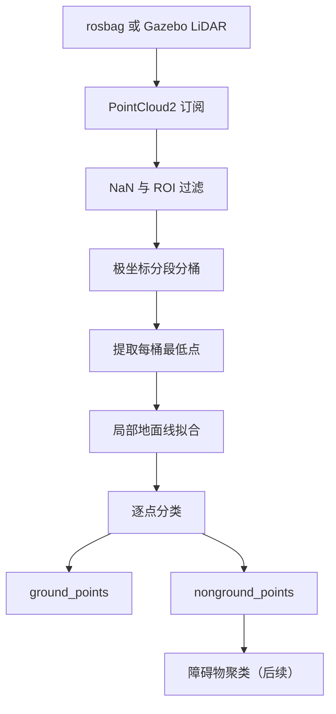

# FSAC LiDAR 地面分割项目

本项目面向大学生无人驾驶方程式赛车（FSAC），目标是从 LiDAR 点云中分离地面点和非地面点，并在此基础上继续实现障碍物聚类、锥桶候选检测以及 Gazebo 仿真验证。

当前阶段只实现以下主链路：

```text
ROS 2 bag 点云
    → 点云预处理
    → 极坐标分段与分桶
    → 局部地面线拟合
    → 地面点 / 非地面点
```

算法节点只依赖 ROS 2 话题接口。后续接入 Gazebo 时只更换输入话题，不重写地面分割算法。

## 1. 项目目录

```text
racecar_sim/
├── README.md
├── data/                              # rosbag 和原始数据，只读挂载到容器 /data
│   ├── rosbag2_2022_04_14-ped_vehicle/
│   ├── rosbag2_2022_04_14-trucks/
│   └── T-SOLO-PYLON/
├── docker/
│   ├── compose.yaml                   # 算法容器配置
│   └── Dockerfile.algorithm           # ROS 2 Jazzy 算法镜像
├── ros2_ws/                           # 地面分割算法工作区，挂载到容器 /ws
│   └── src/
│       └── fast_ground_segmenter/
│           ├── CMakeLists.txt
│           ├── package.xml
│           ├── config/
│           │   └── ground_segmenter.yaml
│           ├── launch/
│           │   ├── bag_ground_segmentation.launch.py
│           │   └── gazebo_ground_segmentation.launch.py
│           ├── include/fast_ground_segmenter/
│           │   ├── ground_segmenter_node.hpp
│           │   ├── point_cloud_filter.hpp
│           │   ├── polar_grid.hpp
│           │   ├── ground_line_fitter.hpp
│           │   └── types.hpp
│           ├── src/
│           │   ├── ground_segmenter_node.cpp
│           │   ├── point_cloud_filter.cpp
│           │   ├── polar_grid.cpp
│           │   ├── ground_line_fitter.cpp
│           │   └── main.cpp
│           └── test/
│               ├── test_point_cloud_filter.cpp
│               ├── test_polar_grid.cpp
│               └── test_ground_line_fitter.cpp
└── simulation_ws/                     # 后续 Gazebo Harmonic 仿真工作区
    └── src/
        ├── racecar_description/
        └── racecar_gazebo/
```

目前尚未创建的目录和源文件，在实现对应阶段时再添加。

## 2. 模块职责

| 模块 | 职责 |
|---|---|
| `ground_segmenter_node` | 订阅和发布 ROS 2 消息、读取参数、组织算法流程 |
| `point_cloud_filter` | 删除 NaN/Inf，进行距离和高度 ROI 过滤 |
| `polar_grid` | 计算极坐标，将点按角度段和距离桶组织起来 |
| `ground_line_fitter` | 提取桶最低点、拟合局部地面线并分类点云 |
| `types.hpp` | 定义桶、地面线、点索引等公共数据结构 |
| `ground_segmenter.yaml` | 保存输入话题、ROI 和算法阈值 |
| `launch/` | 分别提供 rosbag 和 Gazebo 启动入口 |
| `test/` | 对过滤、索引和拟合逻辑进行单元测试 |

ROS 2 节点层只负责消息接口，核心算法类尽量不依赖 ROS 2，便于测试和复用。

## 3. 系统数据流



## 4. 开发阶段与验收标准

### 阶段 1：打通 PointCloud2 输入输出

任务：

- 使用 `rclcpp::SensorDataQoS()` 订阅原始点云；
- 输出点数、时间戳和 `frame_id`；
- 将输入点云原样发布到 `/debug/pass_through_points`；
- 在 RViz2 中对比输入与输出点云。

验收标准：

- 节点能够持续接收约 10 Hz 点云；
- 没有 QoS 不兼容提示；
- 输入与输出点数一致；
- RViz2 可以显示转发后的点云。

### 阶段 2：PCL 转换与 ROI 过滤

处理流程：

```text
sensor_msgs::msg::PointCloud2
    → pcl::PointCloud<pcl::PointXYZI>
    → 删除 NaN/Inf
    → 距离过滤
    → 高度过滤
```

径向距离：

$$
r = \sqrt{x^2+y^2}
$$

建议初始范围：

```yaml
min_range: 1.0
max_range: 80.0
min_z: -3.0
max_z: 2.0
```

输出调试话题：

```text
/debug/filtered_points
```

验收标准：

- 删除无效点、车身附近反射和过远点；
- 道路与主要障碍物仍然保留；
- 输出点数小于输入点数；
- 输出消息保留输入消息的 `header`。

### 阶段 3：极坐标分段与分桶

对每个点计算：

$$
r = \sqrt{x^2+y^2}, \qquad \theta = \operatorname{atan2}(y,x)
$$

推荐初始设置：

```yaml
num_segments: 360
num_bins: 120
```

角度段和距离桶索引：

$$
i_s = \left\lfloor\frac{\theta+\pi}{2\pi}N_s\right\rfloor
$$

$$
i_b = \left\lfloor\frac{r-r_{\min}}{r_{\max}-r_{\min}}N_b\right\rfloor
$$

每个桶至少保存：

```cpp
struct Bin
{
    bool occupied{false};
    float min_z{0.0F};
    float min_range{0.0F};
    std::size_t min_point_index{0};
    std::vector<std::size_t> point_indices;
};
```

验收标准：

- 每个有效点都映射到合法索引；
- 边界角度和最大距离处不发生数组越界；
- 能够发布每个非空桶的最低点。

### 阶段 4：提取地面候选点

在每个非空桶中选择 `z` 最小的点作为地面候选点，并发布：

```text
/debug/bin_min_points
```

最低点只是拟合输入，不能直接全部判定为地面。障碍物底部、路缘和稀疏区域的最低点仍可能不是道路。

验收标准：

- 大部分候选点落在道路表面；
- 空桶能够被安全跳过；
- 候选点按角度段和距离保持正确顺序。

### 阶段 5：局部地面线拟合

在每个角度段内，按距离从近到远处理最低点：

```text
(r1, z1), (r2, z2), ..., (rn, zn)
```

局部地面模型：

$$
z = ar+b
$$

其中 `a` 表示坡度，`b` 表示相对于 LiDAR 的地面高度。不要使用一条直线拟合完整的 80 m 范围，应根据坡度、高度跳变和拟合误差建立多个局部线段。

建议初始参数：

```yaml
max_slope_deg: 10.0
max_fit_error: 0.15
max_start_height_error: 0.30
long_threshold: 2.0
max_long_height_error: 0.10
```

验收标准：

- 平坦道路形成连续地面线；
- 缓坡不会全部被误判成障碍物；
- 单个异常最低点不会显著改变整条拟合线。

### 阶段 6：地面与非地面分类

对每个点计算对应距离处的预测地面高度：

$$
z_{\text{ground}} = ar+b
$$

以及垂直高度差：

$$
d_z = \left|z-z_{\text{ground}}\right|
$$

当 `d_z` 小于阈值时判为地面点，否则判为非地面点。建议初始阈值：

```yaml
max_point_to_line_distance: 0.20
```

正式输出：

```text
/ground_points
/nonground_points
```

验收标准：

- 道路大部分被判断为地面；
- 车辆、行人、路缘和锥桶大部分被判断为非地面；
- 连续帧中没有严重的红绿闪烁；
- `地面点数 + 非地面点数 ≈ 过滤后点数`。

## 5. ROS 2 接口

节点名称：

```text
ground_segmenter_node
```

输入参数：

```yaml
input_topic: /sensing/lidar/top/rectified/pointcloud
```

输出话题：

| 话题 | 用途 |
|---|---|
| `/ground_points` | 地面点云 |
| `/nonground_points` | 非地面点云，供后续障碍物聚类使用 |
| `/debug/pass_through_points` | 阶段 1 的原样转发点云 |
| `/debug/filtered_points` | ROI 过滤后的点云 |
| `/debug/bin_min_points` | 每个极坐标桶的最低点 |

所有输出点云必须保留输入消息头：

```cpp
output.header = input.header;
```

## 6. 参数文件示例

`ros2_ws/src/fast_ground_segmenter/config/ground_segmenter.yaml`：

```yaml
ground_segmenter_node:
  ros__parameters:
    input_topic: /sensing/lidar/top/rectified/pointcloud

    min_range: 1.0
    max_range: 80.0
    min_z: -3.0
    max_z: 2.0

    num_segments: 360
    num_bins: 120

    max_slope_deg: 10.0
    max_fit_error: 0.15
    max_start_height_error: 0.30
    long_threshold: 2.0
    max_long_height_error: 0.10
    max_point_to_line_distance: 0.20

    publish_debug_clouds: true
```

这些参数只是初始值，需要根据 RViz2 中的实际分割结果调整。

## 7. Docker 开发环境

### 7.1 构建并启动容器

在项目根目录执行：

```bash
cd ~/racecar_sim

docker compose -f docker/compose.yaml \
  up -d --build algorithm
```

进入算法容器：

```bash
docker compose -f docker/compose.yaml exec algorithm bash
```

目录映射：

```text
宿主机 ~/racecar_sim/ros2_ws  → 容器 /ws
宿主机 ~/racecar_sim/data     → 容器 /data（只读）
```

如果修改了 Compose 的挂载关系，需要重新创建容器：

```bash
docker compose -f docker/compose.yaml \
  up -d --build --force-recreate algorithm
```

停止容器：

```bash
docker compose -f docker/compose.yaml down
```

### 7.2 编译 ROS 2 工作区

进入容器后执行：

```bash
cd /ws
source /opt/ros/jazzy/setup.bash

colcon build --symlink-install
source install/setup.bash
```

只编译当前包：

```bash
colcon build \
  --symlink-install \
  --packages-select fast_ground_segmenter
```

## 8. rosbag 测试

在容器中播放 `trucks` 数据：

```bash
ros2 bag play \
  /data/rosbag2_2022_04_14-trucks \
  --loop
```

慢速播放便于观察连续帧：

```bash
ros2 bag play \
  /data/rosbag2_2022_04_14-trucks \
  --rate 0.2 \
  --loop
```

启动算法节点：

```bash
ros2 run fast_ground_segmenter ground_segmenter_node \
  --ros-args \
  -p input_topic:=/sensing/lidar/top/rectified/pointcloud
```

推荐的测试顺序：

1. 单帧点云：检查索引、边界和分类逻辑；
2. 慢速 rosbag：检查连续帧稳定性；
3. 正常 10 Hz 播放：检查实时性；
4. `trucks` 数据：检查道路和车辆；
5. `ped_vehicle` 数据：检查行人和车辆；
6. `T-SOLO-PYLON` 数据：检查赛车与锥桶场景。

## 9. RViz2 设置

宿主机和容器应使用相同的 ROS Domain ID，例如：

```bash
export ROS_DOMAIN_ID=42
rviz2
```

Fixed Frame 设置为点云消息的 `frame_id`。当前数据通常使用：

```text
velodyne_top
```

建议添加以下 `PointCloud2` 显示：

| 点云 | 建议颜色 |
|---|---|
| 原始点云 | 灰色 |
| `/debug/filtered_points` | 白色 |
| `/debug/bin_min_points` | 蓝色 |
| `/ground_points` | 绿色 |
| `/nonground_points` | 红色 |

QoS 设置：

```text
Reliability Policy: Best Effort
Durability Policy: Volatile
```

## 10. Gazebo 仿真阶段

真实数据上的地面分割稳定后，再实现以下链路：

```text
racecar_description
    → 赛车 URDF/Xacro
    → LiDAR 安装坐标
    → Gazebo Harmonic 世界
    → gpu_lidar
    → ros_gz_bridge
    → /lidar/points
```

Gazebo 测试场景按照以下顺序增加：

1. 平地和静止 LiDAR；
2. 平地和锥桶；
3. 斜坡；
4. 运动的赛车；
5. 转弯和起伏路面；
6. LiDAR 噪声。

接入 Gazebo 后只修改：

```yaml
input_topic: /lidar/points
```

## 11. 后续扩展

地面分割稳定后，以 `/nonground_points` 为输入继续实现：

```text
非地面点
    → 欧式聚类
    → 聚类尺寸过滤
    → 锥桶候选物
    → 三维位置和距离
    → Marker / 检测结果发布
```

更远期任务包括：

- LiDAR 与摄像头融合；
- 锥桶颜色识别；
- 数据关联；
- SLAM 建图与定位；
- 赛道边界和中心线生成；
- 路径规划与车辆控制。

## 12. 当前任务清单

- [ ] 阶段 1：完成点云订阅和原样发布
- [ ] 阶段 1：在 RViz2 中验证 QoS 和显示
- [ ] 阶段 2：实现 PCL 转换和 ROI 过滤
- [ ] 阶段 2：发布 `/debug/filtered_points`
- [ ] 阶段 3：实现极坐标段和桶索引
- [ ] 阶段 3：添加边界与数组越界测试
- [ ] 阶段 4：提取并发布桶最低点
- [ ] 阶段 5：实现局部地面线拟合
- [ ] 阶段 6：发布地面与非地面点云
- [ ] 在三个现有 rosbag 上验证准确性和稳定性
- [ ] 测量节点处理频率和单帧耗时
- [ ] 接入 Gazebo Harmonic LiDAR
- [ ] 开发非地面点欧式聚类

当前应从“阶段 1：点云输入输出”开始。每完成一个阶段并通过对应验收标准后，再进入下一阶段。
